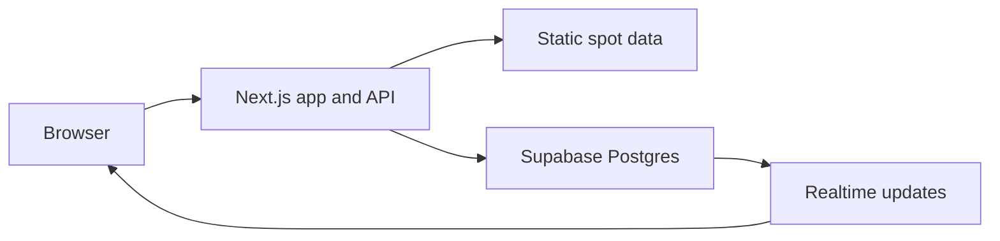

# BadgerDesk

BadgerDesk is a real-time study-spot finder for the UW–Madison campus. It maps 39 locations and combines anonymous reports into live crowd and noise estimates, alongside crowdsourced amenity data such as outlets, group rooms, quiet zones, and natural light.

**Live demo:** `https://your-project.vercel.app`

## Highlights

- Interactive campus map with tri-state filters, walking-distance ranking, and shareable URLs
- Anonymous, account-free crowd and noise reporting
- Time-decay aggregation with historical fallback data
- Live marker updates through Supabase Realtime, with polling fallback
- Community-confirmed amenity data with explicit unknown and disputed states
- Clearly labeled simulated activity for a useful cold-start demo

## Architecture



BadgerDesk separates mostly static campus data from live community data. The 39 spot records ship with the client, so filtering, distance calculation, and ranking require no database round trips. Supabase stores only reports, amenity votes, and hourly aggregates.

Reports are append-only and weighted by recency, allowing inaccurate observations to decay instead of permanently changing a spot. A database constraint limits each anonymous device to one report per spot per hour.

The application uses one storage interface for both environments: Supabase in production and a zero-configuration local store during development. Both backends share the same aggregation logic.

## Tech stack

Next.js 15 · TypeScript · Tailwind CSS v4 · MapLibre GL · OpenFreeMap · TanStack Query · Supabase Postgres · Realtime · Row Level Security · Vitest · Playwright · GitHub Actions

## Run locally

```bash
npm install
npm run seed
npm run dev
```

Open [http://localhost:3000](http://localhost:3000). No environment variables are required; the app automatically uses its local development store with simulated activity.

## Testing

```bash
npm test
npm run e2e
npm run typecheck
npm run build
```

The test suite covers time-decay aggregation, historical fallbacks, amenity-vote states, opening hours, geospatial calculations, filtering, empty-database behavior, reporting flows, keyboard navigation, and URL state.

## Data and attribution

Study-spot locations and opening hours are compiled from public campus information. Map tiles are provided by [OpenFreeMap](https://openfreemap.org), using OpenMapTiles and OpenStreetMap data.
